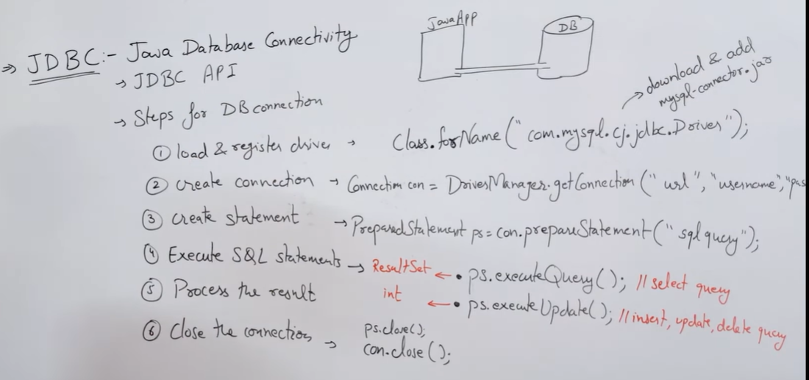

### What is JDBC

**JDBC (Java Database Connectivity)**:
- Meaning: It refers to how we can connect Java to a database.
- For connecting, we use the JDBC API.

### Real-World Scenario

Let's say we have a Java application and a database, each with its own language. Since they don't understand each other's language, we need a translator to facilitate communication between them.

**In technical terms**:
- The translator is referred to as the driver.

### Steps for Database Connection

1. **Load and Register Driver**:
   - First, we need to load and register the driver.

2. **Create the Connection**:
   - After the driver is loaded/registered, we create the connection using `DriverManager.getConnection`.

3. **Create the Statement**:
   - Once the connection is established, we create the statement (like loading a truck).

4. **Execute SQL Statement**:
   - After creating the statement, we execute the SQL statement to store or retrieve data (like sending the truck to its destination and unloading it).

5. **Process the Result**:
   - When the truck unloads, the sender receives a message that the process is complete (process the result).

6. **Close the Connection**:
   - Finally, the sender and receiver close their connection.

### Coding Part

1. **Step One: Load and Register Driver**
   ```java
   Class.forName("com.mysql.jdbc.Driver"); // For MySQL 8 and other versions
   ```
   - Note: Here we need to download and add `mysql-connector.jar`.

2. **Step Two: Create the Connection**
   ```java
   Connection con = DriverManager.getConnection(url, username, password);
   ```
   - `url` refers to the MySQL URL.
   - `username` and `password` are typically `root`, but this can change depending on the database configuration.

3. **Step Three: Create the Statement**
   - We can use `Statement`, `PreparedStatement`, or `CallableStatement`. Here, we will use `PreparedStatement`.
   ```java
   PreparedStatement pstmt = con.prepareStatement(sqlQuery);
   ResultSet rs = pstmt.executeQuery(); // For SELECT queries
   int result = pstmt.executeUpdate(); // For INSERT, UPDATE, DELETE queries
   ```

4. **Close the Connection**
   ```java
   con.close();
   ```



### Simple Steps 

1. Translator for both different languages is `Class.forName("com.mysql.jdbc.Driver")`
2. Next, need SQL connector then `Connection con = DriverManager.getConnection(url, username, password);`
3. After making a connection, we will use the connection object to prepare for a query: `con.prepareStatement(sqlQuery)`
4. Then we will use the `PreparedStatement` object to work with the database like:
   - `pstmt.executeQuery()`
   - `pstmt.executeUpdate()`

Note: 
- We have to bring at first translator to communicate between app and database after that we will make connection and we will prepared the statement and excute it.