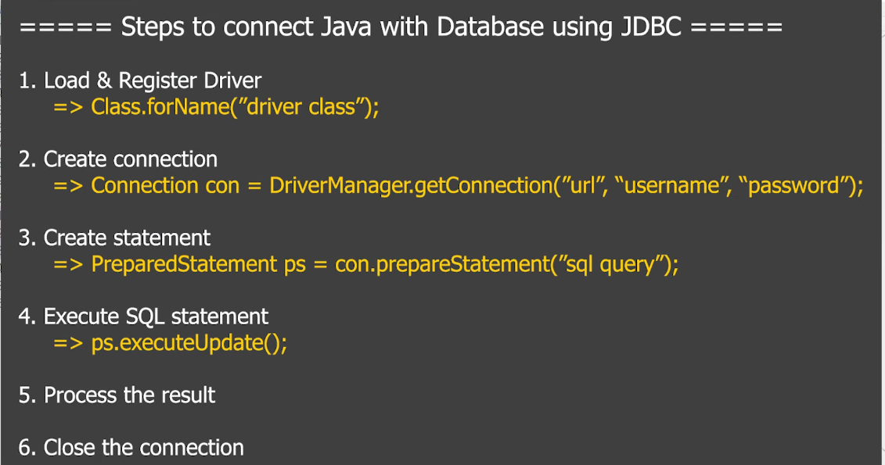

### Insert Data into Table using PreparedStatement

If we want to insert any data to be stored, we need the following software:

- JDK
- IDE

For the database section:

- MySQL 8
- `sqlConnector.jar`
- We also have to create a table



#### Code Part:

```java
class InsertDemo {
    public static void main(String[] args) {  // or we can use throws here
        try {
            Class.forName("com.mysql.jdbc.Driver");
            Connection con = DriverManager.getConnection("jdbc:mysql://localhost:3306/db_first", "root", "root");
            // After making this connection, we will go to the terminal of MySQL
            // - create database db_first
            // - create table (register)
            String sqlQuery = "INSERT INTO register (columns...) VALUES (?, ?, ?, ...)";
            // (use single quotes for string values and +variable_name+ for dynamic values) or we can use positional parameters
            PreparedStatement pstmt = con.prepareStatement(sqlQuery);
            pstmt.setString(1, value1); // like that
            pstmt.setInt(2, value2);
            // set other parameters similarly

            int result = pstmt.executeUpdate();
            if (result > 0) {
                System.out.println("Insert successful");
            } else {
                System.out.println("Insert failed");
            }
        } catch (Exception e) {
            e.printStackTrace();
        }
    }
}
