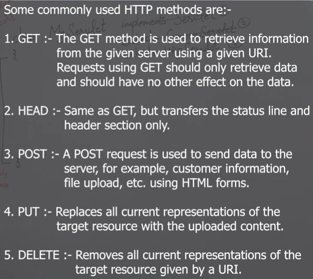
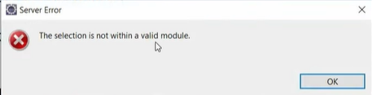

### Hierarchy of Servlet

- `Servlet` is the parent interface which has a predefined class (`GenericServlet`) that inherits the `Servlet` interface.
- The class `HttpServlet` inherits `GenericServlet`.

#### GenericServlet

#### Ways of Making Custom Servlet Code
1. **By Implementing Parent Interface (Servlet)**
   - This is rarely used.
   - **Why is it rarely used?**
     - Because it only defines the servlet lifecycle methods.

2. **By Extending GenericServlet Class**
   - When we extend/inherit `GenericServlet` class, we want to create a protocol-independent servlet where `req` and `res` objects do not exist.
   - When we want to make `req` and `res` objects, we will use `HttpServlet`.

3. **By Extending HttpServlet Class**
   - This is used when we need HTTP-specific methods and the need for `req` and `res` methods.

#### HTTP Methods:


#### HttpServlet Class Methods:
- For GET type request --> use `doGet()` method
- For POST type request --> use `doPost()` method
- For HEAD type request --> use `doHead()` method
- etc.

**Note:**
- The most used methods are GET and POST.

#### Points to be Noted:
- When we create the servlet, we need one more file: a deployment descriptor file named `web.xml`.


### Process of Creating Servlet

1. Create a new project ensuring to check the option (generate `web.xml`).
2. Remove all code from the `web.xml` except the `<web-app>` tag.
3. Go to Java Resources and inside `src/main/java` create any package name and make a simple Java class.
4. Override the `doGet` method for `HttpServlet`.
5. Run the project by right-clicking it.

If you get an error like this:


Then:
- Right-click the project name, choose Properties, then choose Dynamic Web Module and select version 5.0. Done.

After running, if the HTTP status 404 - Not Found error comes, that means we haven't configured the `web.xml`.
We can configure it like this:

```xml
<servlet>
    <servlet-name>myservlet</servlet-name>
    <servlet-class>in.sp.backend.MyServlet</servlet-class>
</servlet>
<servlet-mapping>
    <servlet-name>myservlet</servlet-name>
    <url-pattern>/aaa</url-pattern>
</servlet-mapping>
```

### Understanding URL
`localhost:8080/servletfirstdemo/aaa`

- **Port number where the server is running:** `localhost:8080`
- **Servlet name which we have created:** `servletfirstdemo`
- When we provide `aaa` it comes to `web.xml` and matches the URL pattern and generates the servlet name given in `web.xml` (`myservlet`).
- After generating the servlet name, it checks the servlet tag. If that name `myservlet` exists there, then it will invoke the servlet class `in.sp.backend.MyServlet` and the `doGet` method will be executed.
