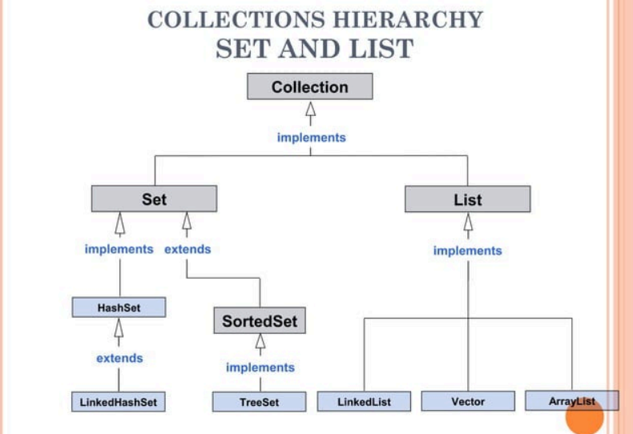
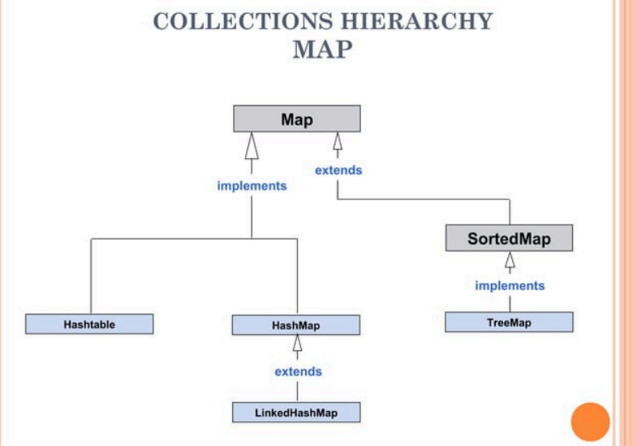
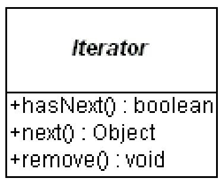
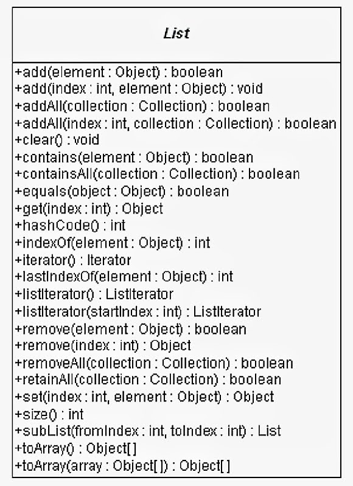
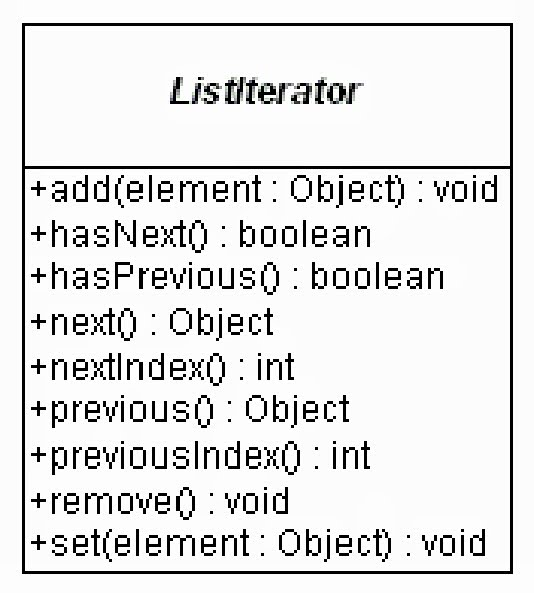
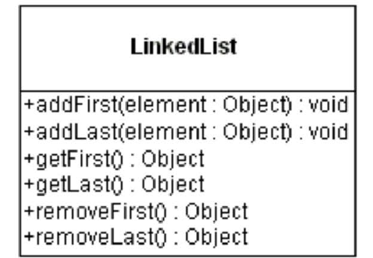
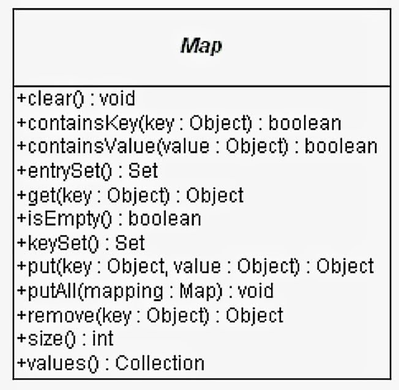
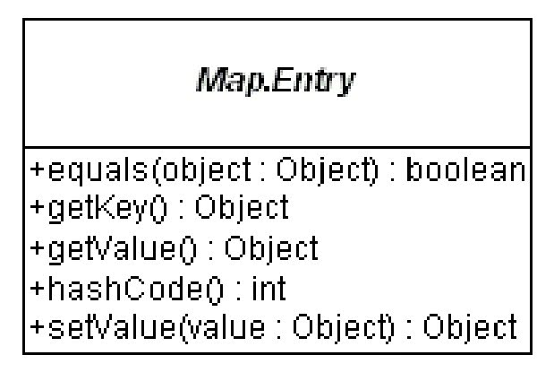

# Collection Framework

- **Collection**: A group of objects.
- **Framework**: A set of classes and interfaces that provide a ready-made architecture.

## Collection Framework Hierarchy

- **Collection (Interface)**
  - **List (Interface)**: Ordered collection, can contain duplicates.
    - `ArrayList` (Class): Resizable array implementation.
    - `LinkedList` (Class): Doubly-linked list implementation.
    - `Vector` (Class): Synchronized resizable array.
    - `Stack` (Class): Last-in-first-out (LIFO) stack.
  - **Set (Interface)**: Unordered collection, no duplicates.
    - `HashSet` (Class): Hash table implementation.
    - `LinkedHashSet` (Class): Hash table and linked list implementation, maintains insertion order.
    - **SortedSet (Interface)**: Sorted set, maintains order.
      - `TreeSet` (Class): Red-black tree implementation, sorts elements.
  - **Queue (Interface)**: Ordered collection, typically FIFO (first-in-first-out).
    - `PriorityQueue` (Class): Priority queue, elements are ordered based on their natural ordering or a comparator.
  - **Deque (Interface)**: Double-ended queue, can add or remove from both ends.
    - `ArrayDeque` (Class): Resizable array implementation of a deque.

## Understanding Class and Interface

- **Class**: 
  - A blueprint from which objects are created.
  - Contains properties (attributes) and methods (functions) that are common to all objects of that type.
  - Example: `class Car` with properties like `color` and `model`, and methods like `drive` and `brake`.

- **Interface**: 
  - A reference type in Java, similar to a class, that can contain only constants, method signatures, default methods, static methods, and nested types.
  - Methods in an interface are abstract by default (they don't have a body).
  - Defines what a class must do, but not how it does it.
  - Example: `interface Drivable` with methods like `drive` and `stop` that must be implemented by any class that implements the interface.

---
## Methods of the Collection Interface

- **add()**
  - Used to insert an element into the collection.

- **addAll()**
  - Used to insert all elements from a specified collection into the invoking collection.

- **remove()**
  - Used to delete an element from the collection.

- **removeAll()**
  - Used to delete all elements from the specified collection from the invoking collection.

- **removeIf()**
  - Used to delete all elements that satisfy a specified condition (predicate).

- **retainAll()**
  - Used to keep only the elements in the invoking collection that are also in the specified collection.

- **size()**
  - Returns the total number of elements in the collection.

- **clear()**
  - Removes all elements from the collection.

- **contains()**
  - Checks if the collection contains a specified element.

- **containsAll()**
  - Checks if the collection contains all elements from a specified collection.

- **iterator()**
  - Returns an iterator to traverse the elements in the collection.

- **toArray()**
  - Converts the collection into an array.

- **isEmpty()**
  - Checks if the collection is empty.

---
## Subinterfaces of the Collection Interface

### List Interface

- **Description**
  - The List interface is a child interface of the Collection interface.
  - Represents an ordered collection of objects, allowing duplicate values.
  - It is implemented by classes like `ArrayList`, `LinkedList`, `Vector`, and `Stack`.

- **Examples**
  1. `List<data-type> list1 = new ArrayList<>();`
  2. `List<data-type> list2 = new LinkedList<>();`
  3. `List<data-type> list3 = new Vector<>();`
  4. `List<data-type> list4 = new Stack<>();`

---
### Set Interface

- **Description**
  - Represents an unordered set of elements that do not allow duplicates.
  - Can store at most one null value.
  - Implemented by `HashSet`, `LinkedHashSet`, and `TreeSet`.

- **Examples**
  1. `Set<data-type> s1 = new HashSet<>();`
  2. `Set<data-type> s2 = new LinkedHashSet<>();`
  3. `Set<data-type> s3 = new TreeSet<>();`

### Queue Interface

- **Description**
  - Maintains a first-in-first-out (FIFO) order.
  - Used to hold elements that are about to be processed.
  - Implemented by classes like `PriorityQueue`, `Deque`, and `ArrayDeque`.

- **Examples**
  1. `Queue<String> q1 = new PriorityQueue<>();`
  2. `Queue<String> q2 = new ArrayDeque<>();`
---
### Advantages of Java Collections Framework

- **High Performance and Efficiency**
  - Various implementations of each interface can be used interchangeably.
  - Programs can be optimized by switching implementations.

- **Uniform Method Implementation**
  - Common interfaces like `Set`, `Map`, and `List` have consistent methods across different implementations.

- **Reduced Programming Effort**
  - Provides ready-made data structures and algorithms.
  - Eliminates the need to write custom data structures.

- **Facilitates Code Reusability**
  - Common classes and interfaces can be used with different types of collections.
---

## Collection Implementations

| Interface | Implementation | Historical |
|-----------|----------------|------------|
| Set       | HashSet        |            |
|           | TreeSet        |            |
| List      | ArrayList      | Vector     |
|           | LinkedList     | Stack      |
| Map       | HashMap        | Hashtable  |
|           | TreeMap        | Properties |

- Hierarchy of List & Set Interface:



- Hirarcy of Map Interface:



## Note:

- When transitioning from historical collection classes to the new framework classes, one of the primary differences is that all operations are unsynchronized with the new classes.

- While we can add synchronization to the new classes, we cannot remove it from the old.

---
## Iterator Interface

It contains the following methods:



### Implementation Example:

```java
Collection collection = ...;
Iterator iterator = collection.iterator();
while (iterator.hasNext()) {
    Object element = iterator.next();
    if (removalCheck(element)) {
        iterator.remove();
    }
}
```
---
# Part 2 with More Clearity:
## Collection Methods Hierarchy

### Single Operation

- `boolean add(Object element)`: Adds an element to the collection.
- `boolean remove(Object element)`: Removes an element from the collection.

### Query Operations

- `int size()`: Returns the total number of elements in the collection.
- `boolean isEmpty()`: Checks if the collection is empty.
- `boolean contains(Object element)`: Checks if the collection contains a specified element.
- `Iterator iterator()`: Returns an iterator to traverse the elements in the collection.

### Group Operations

Other operations the Collection interface supports are tasks done on groups of elements or the entire collection at once:

- `boolean containsAll(Collection collection)`: Checks if the current collection contains all elements of another collection (a subset).
- `boolean addAll(Collection collection)`: Adds all elements from another collection to the current collection (usually a union).
- `void clear()`: Removes all elements from the current collection.
- `void removeAll(Collection collection)`: Removes all elements from the current collection that are also in another collection (a subset).
- `void retainAll(Collection collection)`: Removes from the current collection those elements not in another collection (an intersection).

## Set Interface

- The Set interface extends the Collection interface and prohibits duplicates within the collection.
- All original methods from the Collection interface are present, and no new methods are introduced.
- Concrete Set implementation classes rely on the `equals()` method of the object added to check for equality.

### HashSet and TreeSet Classes

- **HashSet**: Faster for adding elements, doesn't maintain order.
- **TreeSet**: Maintains elements in sorted order.

### Set Usage Example

```java
import java.util.*;

public class SetExample {
    public static void main(String args[]) {
        Set<String> set = new HashSet<>();
        set.add("Bernadine");
        set.add("Elizabeth");
        set.add("Gene");
        set.add("Elizabeth");
        set.add("Clara");
        System.out.println(set);
        
        Set<String> sortedSet = new TreeSet<>(set);
        System.out.println(sortedSet);
    }
}

// Output:
// [Gene, Clara, Bernadine, Elizabeth]
// [Bernadine, Clara, Elizabeth, Gene]
```

### AbstractSet Class

- The AbstractSet class overrides the `equals()` and `hashCode()` methods to ensure that two equal sets return the same hash code.
- Two sets are considered equal if they are the same size and contain the same elements.
- The hash code for a set is the sum of the hash codes for the elements of the set, regardless of internal ordering.

## List Interface



- The List interface extends the Collection interface to define an ordered collection that permits duplicates.
- Adds position-oriented operations and the ability to work with specific parts of the list.

## ListIterator Interface



- The ListIterator interface extends the Iterator interface to support bi-directional access and adding or changing elements in the underlying collection.

### Example of Looping Backwards Through a List

```java
List list = ...;
ListIterator iterator = list.listIterator(list.size());
while (iterator.hasPrevious()) {
    Object element = iterator.previous();
    // Process element
}
```

### ArrayList and LinkedList Classes

- There are two general-purpose List implementations in the Collections Framework: ArrayList and LinkedList.
- The choice between the two depends on specific needs.
  - **ArrayList**: Optimal for random access without frequent insertions or removals from places other than the end.
  - **LinkedList**: Better for frequent insertions and removals from the middle, with sequential access to list elements.
- Both ArrayList and LinkedList implement the `Cloneable` interface.
- LinkedList adds several methods for working with elements at the ends of the list.

### LinkedList New Methods


### Usages

```java
LinkedList queue = ...;
queue.addFirst(element);
Object object = queue.removeLast();

LinkedList stack = ...;
stack.addFirst(element);
Object object = stack.removeFirst();
```

### List Usage Example

The following program demonstrates the use of the concrete List classes. The first part creates a List backed by an ArrayList. After filling the list, specific entries are retrieved. The LinkedList part of the example treats the LinkedList as a queue, adding things at the beginning of the queue and removing them from the end.

```java
import java.util.*;

public class ListExample {
    public static void main(String args[]) {
        List<String> list = new ArrayList<>();
        list.add("Bernadine");
        list.add("Elizabeth");
        list.add("Gene");
        list.add("Elizabeth");
        list.add("Clara");
        System.out.println(list);
        System.out.println("2: " + list.get(2));
        System.out.println("0: " + list.get(0));

        LinkedList<String> queue = new LinkedList<>();
        queue.addFirst("Bernadine");
        queue.addFirst("Elizabeth");
        queue.addFirst("Gene");
        queue.addFirst("Elizabeth");
        queue.addFirst("Clara");
        System.out.println(queue);
        queue.removeLast();
        queue.removeLast();
        System.out.println(queue);
    }
}

// Output
/**
[Bernadine, Elizabeth, Gene, Elizabeth, Clara]
2: Gene
0: Bernadine
[Clara, Elizabeth, Gene, Elizabeth, Bernadine]
[Clara, Elizabeth, Gene]
**/
```

## Map Interface

- The Map interface is not an extension of the Collection interface but starts off its own interface hierarchy for maintaining key-value associations.
- Describes a mapping from keys to values without duplicate keys.



### Alteration Operations

- Allows adding and removing key-value pairs from the map.
  - `Object put(Object key, Object value)`
  - `Object remove(Object key)`
  - `void putAll(Map mapping)`
  - `void clear()`

### Query Operations

- Allows checking the contents of the map.
  - `Object get(Object key)`
  - `boolean containsKey(Object key)`
  - `boolean containsValue(Object value)`
  - `int size()`
  - `boolean isEmpty()`

### Group Operations

- Allows working with the group of keys or values as a collection.
  - `public Set keySet()`
  - `public Collection values()`
  - `public Set entrySet()`

### Map.Entry Interface

- The `entrySet()` method of Map returns a collection of objects that implement the Map.Entry interface.
- Each object in the collection represents a specific key-value pair in the underlying Map.



### HashMap and TreeMap Classes

- The Collections Framework provides two general-purpose Map implementations: HashMap and TreeMap.
- HashMap allows tuning initial capacity and load factor for space optimization.
- TreeMap's tree is always balanced.
- Both HashMap and TreeMap implement the Cloneable interface.


### Map Usage Example

The following program demonstrates the use of concrete Map classes. It generates a frequency count of words passed from the command line. Initially, a HashMap is used for data storage. Afterwards, the map is converted to a TreeMap to display the key list sorted.

```java
import java.util.*;

public class MapExample {
    public static void main(String args[]) {
        Map<String, Integer> map = new HashMap<>();
        Integer ONE = new Integer(1);
        for (int i = 0, n = args.length; i < n; i++) {
            String key = args[i];
            Integer frequency = map.get(key);
            if (frequency == null) {
                frequency = ONE;
            } else {
                int value = frequency.intValue();
                frequency = value + 1;
            }
            map.put(key, frequency);
        }
        System.out.println("Unsorted:");
        System.out.println(map);
        
        Map<String, Integer> sortedMap = new TreeMap<>(map);
        System.out.println("and sorted:");
        System.out.println(sortedMap);
    }
}
// Output:
/**
Unsorted:
{prescribed=1, a=1, time=2, any=1, no=1, shall=1, nor=1, peace=1, owner=1, soldier=1, to=1, the=2, law=1, but=1, manner=1, without=1, house=1, in=4, by=1, consent=1, war=1, quartered=1, be=2, of=3}

and sorted:
{a=1, any=1, be=2, but=1, by=1, consent=1, house=1, in=4, law=1, manner=1, no=1, nor=1, of=3, owner=1, peace=1, prescribed=1, quartered=1, shall=1, soldier=1, the=2, time=2, to=1, war=1, without=1}
**/
```

### AbstractMap Class

- The AbstractMap class overrides the `equals()` and `hashCode()` methods to ensure two equal maps return the same hash code.

### WeakHashMap Class

- A WeakHashMap is a special-purpose implementation of Map for storing only weak references to the keys. 
- Allows key-value pairs to be garbage collected when the key is no longer referenced outside of the WeakHashMap. 
- Useful for maintaining registry-like data structures where the entry usefulness vanishes when its key is no longer reachable.

## Sorting

- To take advantage of sorting capabilities, the Collections Framework provides two interfaces: SortedSet and SortedMap.


```java

```