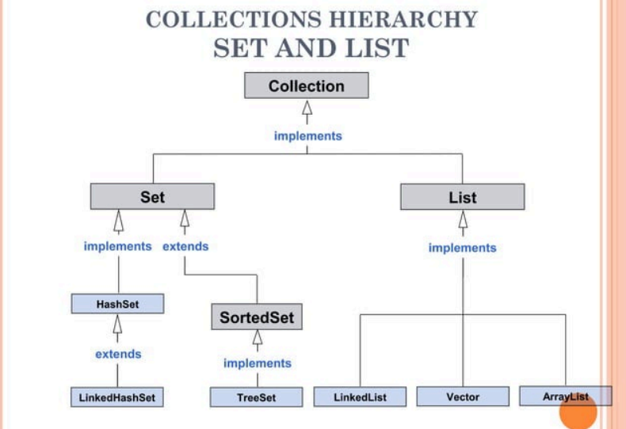
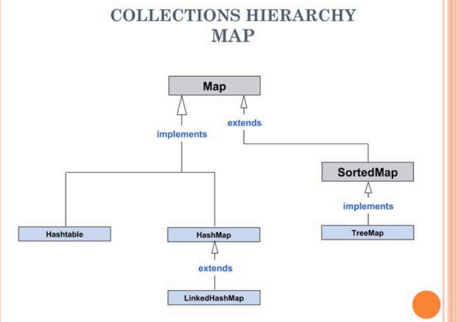
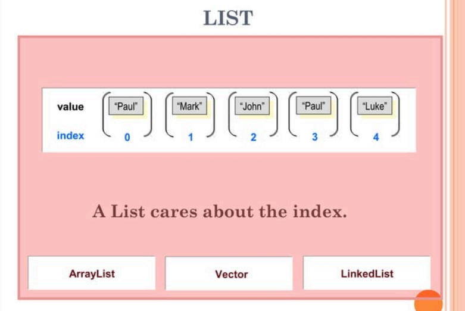
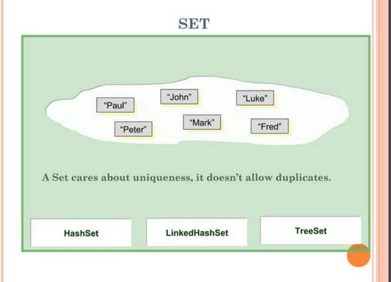
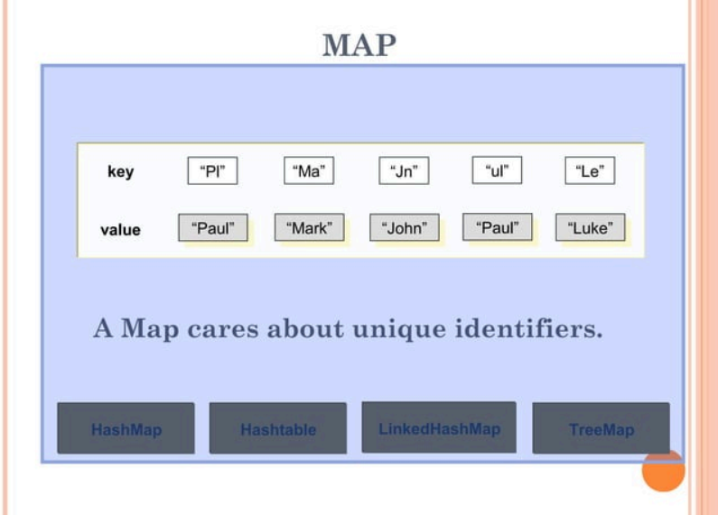

## Collection FRAMEWORK

The collections framework is a unified architecture for representing and manipulating collections, enabling them to be manipulated independently of the details of their representation. It reduces programming effort while increasing performance. It enables interoperability among unrelated APIs, reduces effort in designing and learning new APIs, and fosters software reuse. The framework is based on more than a dozen collection interfaces. It includes implementations of these interfaces and algorithms to manipulate them.

### CONTENTS

- What is Collection?
- Collections Framework
- Collections Hierarchy
- Collections Implementations
  - Set
  - List
- Map


### WHAT IS A COLLECTION?

- A Collection (also known as container) is an object that contains a group of objects treated as a single unit.
- Any type of objects can be stored, retrieved, and manipulated as elements of collections.

### COLLECTIONS FRAMEWORK

Collections Framework is a unified architecture for managing collections.

#### Main Parts of Collections Framework

1. Interfaces
   - Core interfaces defining common functionality exhibited by collections.
2. Implementations
   - Concrete classes of the core interfaces providing data structures.
3. Operations
   - Methods that perform various operations on collections.


### OPERATIONS

#### Basic collection operations:

- Check if collection is empty
- Check if an object exists in collection.
- Retrieve an object from collection
- Add object to collection
- Remove object from collection
- Iterate collection and inspect each object

Note:
* Each operation has a corresponding method implementation for each collection type

### COLLECTIONS CHARACTERISTICS

- Ordered
  * Elements are stored and accessed in a specific order
- Sorted
  * Elements are stored and accessed in a sorted order
- Indexed
  * Elements can be accessed using an index
- Unique
  * Collection does not allow duplicates


### ITERATOR

- An iterator is an object used to mark a position in a collection of data and to move from item to item within the collection.

Syntax:
```java
Iterator <variable> = <CollectionObject>.iterator();
```
### COLLECTIONS HIERARCHY

1. SET AND LIST



2. MAP




### COLLECTIONS FRAMEWORK INTERFACES

| Core Interfaces | Description                                               |
|-----------------|-----------------------------------------------------------|
| Collection      | Specifies contract that all collections should implement  |
| Set             | Defines functionality for a set of unique elements        |
| SortedSet       | Defines functionality for a set where elements are sorted |
| List            | Defines functionality for an ordered list of non-unique elements |
| Map             | Defines functionality for mapping of unique keys to values |
| SortedMap       | Defines functionality for a map where its keys are sorted |


### COLLECTIONS FRAMEWORK IMPLEMENTATIONS

|       Set         |       List        |        Map        |
|-------------------|-------------------|-------------------|
| HashSet           | ArrayList         | HashMap           |
| LinkedHashSet     | LinkedList        | LinkedHashMap     |
| TreeSet           | Vector            | Hashtable         |

Note: Hashtable uses a lower-case "t"


### List

Lists of things (classes that implement List)



#### LIST IMPLEMENTATIONS

- ARRAY LIST

```java
import java.util.ArrayList;

public class MyArrayList {
    public static void main(String args[]) {
        ArrayList alist = new ArrayList();
        alist.add(new String("One"));
        alist.add(new String("Two"));
        alist.add(new String("Three"));

        System.out.println(alist.get(0));
        System.out.println(alist.get(1));
        System.out.println(alist.get(2));
    }
}

// Output:
// One
// Two
// Three

```

- VECTOR

```java
import java.util.Vector;

public class MyVector {
    public static void main(String args[]) {
        Vector vecky = new Vector();
        vecky.add(new Integer(1));
        vecky.add(new Integer(2));
        vecky.add(new Integer(3));
        
        for (int x = 0; x < 3; x++) {
            System.out.println(vecky.get(x));
        }
    }
}

// Output:
// 1
// 2
// 3
```

- LINKED LIST

```java
import java.util.LinkedList;

public class MyLinkedList {
    public static void main(String args[]) {
        LinkedList link = new LinkedList();
        link.add(new Double(2.0));
        link.addLast(new Double(3.0));
        link.addFirst(new Double(1.0));
        
        Object array[] = link.toArray();
        for(int x = 0; x < 3; x++) {
            System.out.println(array[x]);
        }
    }
}

// Output:
// 1.0
// 2.0
// 3.0
```


### Set

Unique things (classes that implement Set)



#### SET IMPLEMENTATIONS

- HASH SET

```java
import java.util.*;

public class MyHashSet {
    public static void main(String args[]) {
        HashSet hash = new HashSet();
        hash.add("a");
        hash.add("b");
        hash.add("c");
        hash.add("d");
        
        Iterator iterator = hash.iterator();
        while (iterator.hasNext()) {
            System.out.println(iterator.next());
        }
    }
}

// Output:
// d
// a
// c
// b
```

- LINKED HASH SET

```java
import java.util.LinkedHashSet;

public class MyLinkedHashSet {
    public static void main(String args[]) {
        LinkedHashSet lhs = new LinkedHashSet();
        lhs.add(new String("One"));
        lhs.add(new String("Two"));
        lhs.add(new String("Three"));
        
        Object array[] = lhs.toArray();
        for(int x = 0; x < 3; x++) {
            System.out.println(array[x]);
        }
    }
}

// Output:
// One
// Two
// Three
```


- TREE SET

```java
import java.util.TreeSet;
import java.util.Iterator;

public class MyTreeSet {
    public static void main(String args[]) {
        TreeSet tree = new TreeSet();
        tree.add("Jody");
        tree.add("Remiel");
        tree.add("Reggie");
        tree.add("Philippe");
        
        Iterator iterator = tree.iterator();
        while (iterator.hasNext()) {
            System.out.println(iterator.next().toString());
        }
    }
}

// Output:
// Jody
// Philippe
// Reggie
// Remiel
```


### Map

Things with a unique ID (classes that implement Map)



#### MAP IMPLEMENTATIONS

- HASH MAP

```java
import java.util.HashMap;

public class MyHashMap {
    public static void main(String args[]) {
        HashMap map = new HashMap();
        map.put("name", "Jody");
        map.put("id", new Integer(446));
        map.put("address", "Manila");
        
        System.out.println("Name: " + map.get("name"));
        System.out.println("ID: " + map.get("id"));
        System.out.println("Address: " + map.get("address"));
    }
}

// Output:
// Name: Jody
// ID: 446
// Address: Manila
```


- HASH TABLE

```java
import java.util.Hashtable;

public class MyHashtable {
    public static void main(String args[]) {
        Hashtable table = new Hashtable();
        table.put("name", "Jody");
        table.put("id", new Integer(1001));
        table.put("address", new String("Manila"));
        
        System.out.println("Table of Contents: " + table);
    }
}

// Output:
// Table of Contents: {address=Manila, name=Jody, id=1001}
```

- LINKED HASH MAP

```java
import java.util.*;

public class MyLinkedHashMap {
    public static void main(String args[]) {
        int iNum = 0;
        LinkedHashMap myMap = new LinkedHashMap();
        myMap.put("name", "Jody");
        myMap.put("id", new Integer(446));
        myMap.put("address", "Manila");
        myMap.put("type", "Savings");
        
        Collection values = myMap.values();
        Iterator iterator = values.iterator();
        while (iterator.hasNext()) {
            System.out.println(iterator.next());
        }
    }
}

// Output:
// Jody
// 446
// Manila
// Savings
```


- TREE MAP

```java
import java.util.*;

public class MyTreeMap {
    public static void main(String args[]) {
        TreeMap treeMap = new TreeMap();
        treeMap.put("name", "Jody");
        treeMap.put("id", new Integer(446));
        treeMap.put("address", "Manila");
        
        Collection values = treeMap.values();
        Iterator iterator = values.iterator();
        System.out.println("Printing the VALUES....");
        while (iterator.hasNext()) {
            System.out.println(iterator.next());
        }
    }
}

// Output:
// Printing the VALUES....
// Manila
// 446
// Jody
```
