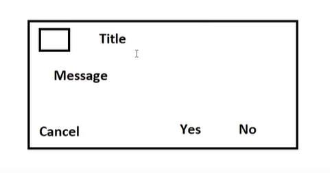

### AlertDialog

- AlertDialog includes this Things so we have to setthen into our code:


```java
AlertDialog.Builder builder = new AlertDialog.Builder(this);
builder.setTitle("Alert Dialog")
       .setMessage("This is an AlertDialog example.")
       .setPositiveButton("OK", new DialogInterface.OnClickListener() {
           @Override
           public void onClick(DialogInterface dialog, int which) {
               // Handle positive button click
               dialog.dismiss();
           }
       })
       .setNegativeButton("Cancel", new DialogInterface.OnClickListener() {
           @Override
           public void onClick(DialogInterface dialog, int which) {
               // Handle negative button click
               dialog.dismiss();
           }
       })
       .show();
```

### Custom AlertDialog

```java
Dialogue dialogue = new Dialogue(ThisClass.this);
dialogue.setContentView(R.layout.cus_dig);

Button btn = dialogue.findViewById(R.id.button); // Assuming there is a button with id "button" in cus_dig layout

btn.setOnClickListener(new View.OnClickListener() {
    @Override
    public void onClick(View v) {
        // Perform actions when button is clicked
        Toast.makeText(ThisClass.this, "Button Clicked", Toast.LENGTH_SHORT).show();
        dialogue.dismiss(); // Dismiss the dialog
    }
});

dialogue.show(); // Show the dialog
```

### SeekBar

```xml
<SeekBar
    android:id="@+id/seekBar"
    android:layout_width="match_parent"
    android:layout_height="wrap_content" />
```

#### Usages

```java
SeekBar seekBar = findViewById(R.id.seekBar);
seekBar.setOnSeekBarChangeListener(new SeekBar.OnSeekBarChangeListener() {
    @Override
    public void onProgressChanged(SeekBar seekBar, int progress, boolean fromUser) {
        // Handle seek bar progress change
    }

    @Override
    public void onStartTrackingTouch(SeekBar seekBar) {
        // Called when tracking of the seek bar started
    }

    @Override
    public void onStopTrackingTouch(SeekBar seekBar) {
        // Called when tracking of the seek bar stopped
    }
});
```

### ProgressBar

```xml
<ProgressBar
    android:id="@+id/progressBar"
    style="@android:style/Widget.ProgressBar.Horizontal"
    android:layout_width="match_parent"
    android:layout_height="wrap_content"
    android:progress="50" />
```

#### Usages
```java
ProgressBar progressBar = findViewById(R.id.progressBar);

void count(View view) {
    setProgressbarValue(0);
}

void setProgressbarValue(int i) {
    Thread thread = new Thread(new Runnable() {
        @Override
        public void run() {
            try {
                Thread.sleep(1000);
            } catch (Exception e) {
                e.printStackTrace();
            }
            progressBar.setProgress(i); // Changed 'my_progressbar' to 'progressBar'
            setProgressbarValue(i + 1);
        }
    });
    thread.start();
}
```

### ProgressDialog **Circuler**

```java
void showDialogueOfProgress(View view) {
    progressDialog = new ProgressDialog(this);
    progressDialog.setTitle("Progress Dialog");
    progressDialog.setMessage("Loading...");
    progressDialog.setProgressStyle(ProgressDialog.STYLE_SPINNER);
    progressDialog.setCancelable(false); // Optional
    progressDialog.show();

    Button dismissButton = findViewById(R.id.dismissButton); // Assuming you have a button with id dismissButton
    dismissButton.setOnClickListener(new View.OnClickListener() {
        @Override
        public void onClick(View v) {
            progressDialog.dismiss();
        }
    });

    // Start a new thread to simulate a background task
    new Thread(new Runnable() {
        public void run() {
            // Simulate some background task
            try {
                Thread.sleep(5000); // Simulating a task that takes 5 seconds
                progressDialog.dismiss();
                
            } catch (InterruptedException e) {
                e.printStackTrace();
            }
        }
    }).start();
}
```

### ProgressDialog **Horizentical**

```java
public void openProgressDialogTwo(View view) {
    ProgressDialog progressDialog = new ProgressDialog(ProgressDialogDemoTwo.this);
    progressDialog.setTitle("New Title");
    progressDialog.setMessage("Progress......");
    progressDialog.setIcon(R.drawable.home);
    progressDialog.setProgressStyle(ProgressDialog.STYLE_HORIZONTAL);
    progressDialog.setCancelable(false);
    progressDialog.show();

    Handler handler = new Handler() {
        @Override
        public void handleMessage(@NonNull Message msg) {
            super.handleMessage(msg);
            progressDialog.incrementProgressBy(1);
        }
    };

    new Thread(new Runnable() {
        @Override
        public void run() {
            try {
                while (progressDialog.getProgress() <= 100) {
                    Thread.sleep(100); // Use milliseconds, not "mili FBR"
                    handler.sendMessage(handler.obtainMessage());
                }
            } catch (InterruptedException e) {
                e.printStackTrace();
            }
        }
    }).start();
}
