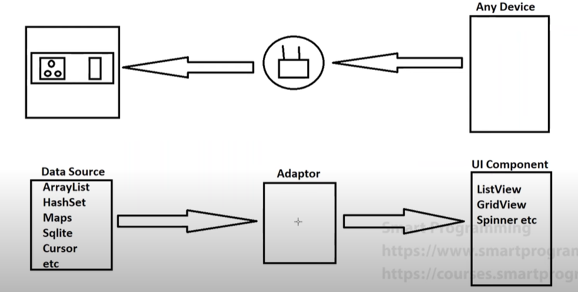
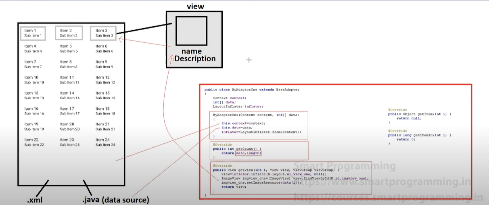

### Adaptor

Adaptor is like a bridge between "Android UI components" and “Data Source". Android UI component can be ListView, GridView, Spinner etc and Data Source can be ArrayList, Set, Map, Cursors, Sqlite etc.

#### Types of Adaptors
1. BaseAdaptor: It is the parent for all the adaptors
2. ArrayAdaptor
3. Custom ArrayAdaptor
4. SimpleAdaptor
5. Custom SimpleAdaptor



- `Working of the Adapters`



- We can Use adapters for the following ways :-


### 1. GridView with Adapter

**XML Files:**

1. `res/layout/main_activity_two.xml` (Main Activity Layout with GridView)
    ```xml
    <?xml version="1.0" encoding="utf-8"?>
    <RelativeLayout xmlns:android="http://schemas.android.com/apk/res/android"
        android:layout_width="match_parent"
        android:layout_height="match_parent">

        <GridView
            android:id="@+id/gridView"
            android:layout_width="match_parent"
            android:layout_height="match_parent"
            android:numColumns="auto_fit"
            android:columnWidth="100dp"
            android:verticalSpacing="10dp"
            android:horizontalSpacing="10dp"
            android:stretchMode="columnWidth"
            android:gravity="center"/>
    </RelativeLayout>
    ```

2. `res/layout/ui_view_two.xml` (Item Layout with ImageView)
    ```xml
    <?xml version="1.0" encoding="utf-8"?>
    <LinearLayout xmlns:android="http://schemas.android.com/apk/res/android"
        android:layout_width="match_parent"
        android:layout_height="wrap_content"
        android:orientation="vertical"
        android:padding="8dp">

        <ImageView
            android:id="@+id/imageView"
            android:layout_width="wrap_content"
            android:layout_height="wrap_content"
            android:src="@drawable/ic_launcher_foreground" />
    </LinearLayout>
    ```

**Java Files:**

1. `MainActivityTwo.java`
    ```java
    package com.example.gridviewexample;

    import android.os.Bundle;
    import android.widget.GridView;
    import androidx.appcompat.app.AppCompatActivity;

    public class MainActivityTwo extends AppCompatActivity {

        private int[] dataSource = {
            R.drawable.image1, R.drawable.image2, R.drawable.image3,
            R.drawable.image4, R.drawable.image5, R.drawable.image6,
            R.drawable.image7, R.drawable.image8, R.drawable.image9, R.drawable.image10
        };

        @Override
        protected void onCreate(Bundle savedInstanceState) {
            super.onCreate(savedInstanceState);
            setContentView(R.layout.main_activity_two);

            GridView gridView = findViewById(R.id.gridView);
            MyAdapterTwo adapter = new MyAdapterTwo(this, dataSource);
            gridView.setAdapter(adapter);
        }
    }
    ```

2. `MyAdapterTwo.java`
    ```java
    package com.example.gridviewexample;

    import android.content.Context;
    import android.view.LayoutInflater;
    import android.view.View;
    import android.view.ViewGroup;
    import android.widget.BaseAdapter;
    import android.widget.ImageView;

    public class MyAdapterTwo extends BaseAdapter {
        private Context context;
        private int[] dataSource;
        private LayoutInflater inflater;

        public MyAdapterTwo(Context context, int[] dataSource) {
            this.context = context;
            this.dataSource = dataSource;
            this.inflater = LayoutInflater.from(context);
        }

        @Override
        public int getCount() {
            return dataSource.length;
        }

        @Override
        public Object getItem(int position) {
            return dataSource[position];
        }

        @Override
        public long getItemId(int position) {
            return position;
        }

        @Override
        public View getView(int position, View convertView, ViewGroup parent) {
            if (convertView == null) {
                convertView = inflater.inflate(R.layout.ui_view_two, parent, false);
            }

            ImageView imageView = convertView.findViewById(R.id.imageView);
            imageView.setImageResource(dataSource[position]);

            return convertView;
        }
    }
    ```

### 2. ListView with Adapter

**XML Files:**

1. `res/layout/main_activity_two.xml` (Main Activity Layout with ListView)
    ```xml
    <?xml version="1.0" encoding="utf-8"?>
    <RelativeLayout xmlns:android="http://schemas.android.com/apk/res/android"
        android:layout_width="match_parent"
        android:layout_height="match_parent">

        <ListView
            android:id="@+id/listView"
            android:layout_width="match_parent"
            android:layout_height="match_parent"/>
    </RelativeLayout>
    ```

2. `res/layout/ui_view_two.xml` (Item Layout with ImageView)
    ```xml
    <?xml version="1.0" encoding="utf-8"?>
    <LinearLayout xmlns:android="http://schemas.android.com/apk/res/android"
        android:layout_width="match_parent"
        android:layout_height="wrap_content"
        android:orientation="horizontal"
        android:padding="8dp">

        <ImageView
            android:id="@+id/imageView"
            android:layout_width="wrap_content"
            android:layout_height="wrap_content"
            android:src="@drawable/ic_launcher_foreground" />
    </LinearLayout>
    ```

**Java Files:**

1. `MainActivityTwo.java`
    ```java
    package com.example.listviewexample;

    import android.os.Bundle;
    import android.widget.ListView;
    import androidx.appcompat.app.AppCompatActivity;

    public class MainActivityTwo extends AppCompatActivity {

        private int[] dataSource = {
            R.drawable.image1, R.drawable.image2, R.drawable.image3,
            R.drawable.image4, R.drawable.image5, R.drawable.image6,
            R.drawable.image7, R.drawable.image8, R.drawable.image9, R.drawable.image10
        };

        @Override
        protected void onCreate(Bundle savedInstanceState) {
            super.onCreate(savedInstanceState);
            setContentView(R.layout.main_activity_two);

            ListView listView = findViewById(R.id.listView);
            MyAdapterTwo adapter = new MyAdapterTwo(this, dataSource);
            listView.setAdapter(adapter);
        }
    }
    ```

2. `MyAdapterTwo.java`
    ```java
    package com.example.listviewexample;

    import android.content.Context;
    import android.view.LayoutInflater;
    import android.view.View;
    import android.view.ViewGroup;
    import android.widget.BaseAdapter;
    import android.widget.ImageView;

    public class MyAdapterTwo extends BaseAdapter {
        private Context context;
        private int[] dataSource;
        private LayoutInflater inflater;

        public MyAdapterTwo(Context context, int[] dataSource) {
            this.context = context;
            this.dataSource = dataSource;
            this.inflater = LayoutInflater.from(context);
        }

        @Override
        public int getCount() {
            return dataSource.length;
        }

        @Override
        public Object getItem(int position) {
            return dataSource[position];
        }

        @Override
        public long getItemId(int position) {
            return position;
        }

        @Override
        public View getView(int position, View convertView, ViewGroup parent) {
            if (convertView == null) {
                convertView = inflater.inflate(R.layout.ui_view_two, parent, false);
            }

            ImageView imageView = convertView.findViewById(R.id.imageView);
            imageView.setImageResource(dataSource[position]);

            return convertView;
        }
    }
    ```

### 3. Spinner with Adapter

**XML Files:**

1. `res/layout/main_activity_two.xml` (Main Activity Layout with Spinner)
    ```xml
    <?xml version="1.0" encoding="utf-8"?>
    <RelativeLayout xmlns:android="http://schemas.android.com/apk/res/android"
        android:layout_width="match_parent"
        android:layout_height="match_parent">

        <Spinner
            android:id="@+id/spinner"
            android:layout_width="wrap_content"
            android:layout_height="wrap_content"
            android:layout_centerInParent="true"/>
    </RelativeLayout>
    ```

2. `res/layout/ui_view_two.xml` (Item Layout with ImageView)
    ```xml
    <?xml version="1.0" encoding="utf-8"?>
    <TextView xmlns:android="http://schemas.android.com/apk/res/android"
        android:id="@+id/textView"
        android:layout_width="wrap_content"
        android:layout_height="wrap_content"
        android:padding="8dp"
        android:textSize="16sp" />
    ```

**Java Files:**

1. `MainActivityTwo.java`
    ```java
    package com.example.spinnerexample;

    import android.os.Bundle;
    import android.widget.Spinner;
    import androidx.appcompat.app.AppCompatActivity;

    public class MainActivityTwo extends AppCompatActivity {

        private String[] dataSource = {
            "Option 1", "Option 2", "Option 3", "Option 4", "Option 5",
            "Option 6", "Option 7", "Option 8", "Option 9", "Option 10"
        };

        @Override
        protected void onCreate(Bundle savedInstanceState) {
            super.onCreate(savedInstanceState);
            setContentView(R.layout.main_activity_two);

            Spinner spinner = findViewById(R.id.spinner);
            MyAdapterTwo adapter = new MyAdapterTwo(this, dataSource);
            spinner.setAdapter(adapter);
        }
    }
    ```

2. `MyAdapterTwo.java`
    ```java
    package com.example.spinnerexample;

    import android.content.Context;
    import android.view.LayoutInflater;
    import android.view.View;
    import android.view.ViewGroup;
    import android.widget.BaseAdapter;
    import android.widget.TextView;

    public class MyAdapterTwo extends BaseAdapter {
        private context;

        private String[] dataSource;
        private LayoutInflater inflater;

        public MyAdapterTwo(Context context, String[] dataSource) {
            this.context = context;
            this.dataSource = dataSource;
            this.inflater = LayoutInflater.from(context);
        }

        @Override
        public int getCount() {
            return dataSource.length;
        }

        @Override
        public Object getItem(int position) {
            return dataSource[position];
        }

        @Override
        public long getItemId(int position) {
            return position;
        }

        @Override
        public View getView(int position, View convertView, ViewGroup parent) {
            if (convertView == null) {
                convertView = inflater.inflate(R.layout.ui_view_two, parent, false);
            }

            TextView textView = convertView.findViewById(R.id.textView);
            textView.setText(dataSource[position]);

            return convertView;
        }

        @Override
        public View getDropDownView(int position, View convertView, ViewGroup parent) {
            if (convertView == null) {
                convertView = inflater.inflate(R.layout.ui_view_two, parent, false);
            }

            TextView textView = convertView.findViewById(R.id.textView);
            textView.setText(dataSource[position]);

            return convertView;
        }
    }
    ```

### Explanations:

### XML Layout Files
1. **main_activity_two.xml**
   - Create a `ListView`.

2. **ui_view_two.xml**
   - Create an `ImageView`.

### Java Files
1. **MainActivityTwo.java**
   - Create a data source (e.g., an array or list of image resources).
   - Get the ID of the `ListView`.
   - Create an instance of `MyAdapterTwo`, passing the application context and data source.
   - Set the adapter instance to the `ListView`.

2. **MyAdapterTwo.java**
   - Extend `BaseAdapter`.
   - Declare instance variables for context, data, and layout inflater.
   - Implement the constructor to initialize these variables and obtain a layout inflater.
   - Override `getCount()` to return the length of the data.
   - Override `getView()`:
     - Inflate the layout `R.layout.ui_view_two`.
     - Get the ID of the `ImageView`.
     - Set the image resource for the `ImageView` using the data.
     - Return the view.


**Note**: For implementating adapters we need Two xml file one which holds design of the widgets lets say `ImageView` and anouther xml will holds the any one of this view(    - GridView (using Adaptors, ListView (using Adaptors), Spinner (using Adaptors)) and we have 2 java file main file will holds the dataSource and anouther will be the adapter java file.