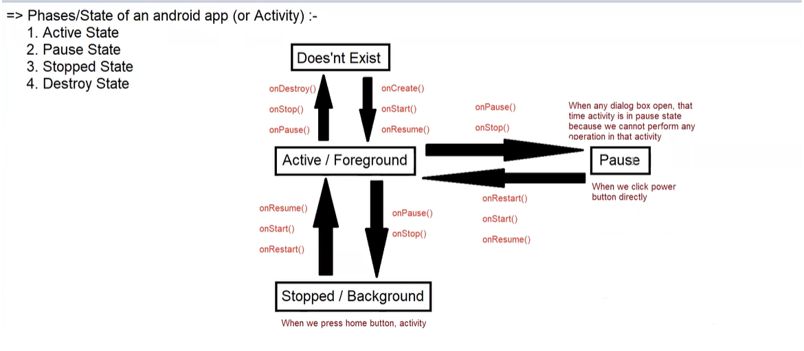

### Android Core Building Blocks:
- An Android component is simply a piece of code that has a well-defined lifecycle.
- For example, Activity, Receiver, Service, etc.
- The main Android core building blocks are:
  1. Activity
  2. AndroidManifest.xml
  3. Android Virtual Device (AVD)
  4. Views
  5. Intent
  6. Fragments
  7. Services
  8. Content Providers

### Activity:
- Activity is one of the most important core building blocks of the Android OS.
- An Activity is just a simple class which represents a single screen.
- Similar to how C, C++, and Java have an entry point, i.e., the `main()` method, Android also has an entry point, i.e., the `onCreate()` method, which is present in the Activity class.
- Every activity contains the layout, i.e., UI (`setContentView(R.layout.layout_name)`).

**How to create an Activity:**
1. Create a simple class and extend it with `AppCompatActivity`.
2. Override the `onCreate()` method (it is the method of the Activity lifecycle).
3. Call `setContentView(R.layout.layout_name)` method.

### Activity LifeCycle States:
1. Doesn't Exist / Destroy
2. Active / Foreground
3. Pause
4. Stopped / Background

### Methods of Activity LifeCycle:
1. `onCreate()` - called when the activity is launched for the first time.
2. `onStart()` - called when the activity is becoming visible to the user.
3. `onPause()` - called when the activity is not visible or the user is not able to interact.
4. `onResume()` - called when the user starts interacting with the activity.
5. `onRestart()` - called when the activity is stopped and then started again.
6. `onStop()` - called when the user is not able to interact with the activity.
7. `onDestroy()` - called when the activity is destroyed.

Understanding Working of Android LifeCycle By Image:

 