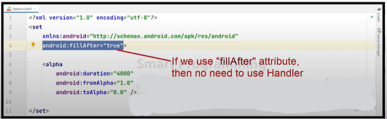

## Topics of Animation Section
### Animation

- Animation using XML files
- Animation between activities
- Animation like battery
- Lottie Files
- Circular image
- Toasty
---

### Animation:
- It is the process by which objects (views in Android) can change their position or shape.

### Types of animations:
1. **Alpha Animation:** Can change the transparency of the view.
2. **Scale Animation:** Can change the size of the view on the x or y axis.
3. **Rotate Animation:** Can rotate the view on a pivot point to a certain degree.
4. **Translate Animation:** Can move the view on the x or y axis.

### Attributes for animations:
1. `android:duration="value"`
2. `android:repeatMode="restart"`
3. `android:repeatCount="infinite"`
4. `android:fillAfter="true"`


### Explanation

### Alpha Animation
```xml
<AlphaAnimation
    android:fromAlpha="1.0" <!-- Starting alpha value -->
    android:toAlpha="0.0" <!-- Ending alpha value -->
    android:duration="1000" <!-- Duration of the animation in milliseconds -->
    android:repeatCount="infinite" <!-- Number of times the animation should repeat (infinite for continuous) -->
    android:repeatMode="reverse" /> <!-- Determines how the animation should behave when it repeats (reverse to alternate direction) -->
```
### Usages 
```java
AlphaAnimation alphaAnimation = new AlphaAnimation(1.0f, 0.0f);
alphaAnimation.setDuration(1000);
view.startAnimation(alphaAnimation);
```
---

### Scale Animation
```xml
<ScaleAnimation
    android:fromXScale="1.0" <!-- Starting scale value on the x-axis -->
    android:toXScale="0.5" <!-- Ending scale value on the x-axis -->
    android:fromYScale="1.0" <!-- Starting scale value on the y-axis -->
    android:toYScale="0.5" <!-- Ending scale value on the y-axis -->
    android:pivotX="50%" <!-- X-axis pivot point of the view -->
    android:pivotY="50%" <!-- Y-axis pivot point of the view -->
    android:duration="1000" /> <!-- Duration of the animation in milliseconds -->
```

### Usages 
```java
ScaleAnimation scaleAnimation = new ScaleAnimation(
    1.0f, 0.5f,
    1.0f, 0.5f,
    Animation.RELATIVE_TO_SELF, 0.5f,
    Animation.RELATIVE_TO_SELF, 0.5f
);
scaleAnimation.setDuration(1000);
view.startAnimation(scaleAnimation);
```
---

### Rotate Animation
```xml
<RotateAnimation
    android:fromDegrees="0" <!-- Starting rotation degree -->
    android:toDegrees="360" <!-- Ending rotation degree -->
    android:pivotX="50%" <!-- X-axis pivot point of the view -->
    android:pivotY="50%" <!-- Y-axis pivot point of the view -->
    android:duration="1000" /> <!-- Duration of the animation in milliseconds -->
```

### Usages 
```java
RotateAnimation rotateAnimation = new RotateAnimation(
    0, 360,
    Animation.RELATIVE_TO_SELF, 0.5f,
    Animation.RELATIVE_TO_SELF, 0.5f
);
rotateAnimation.setDuration(1000);
view.startAnimation(rotateAnimation);
```
---


### Translate Animation
```xml
<TranslateAnimation
    android:fromXDelta="0" <!-- Starting translation distance on the x-axis -->
    android:toXDelta="100" <!-- Ending translation distance on the x-axis -->
    android:fromYDelta="0" <!-- Starting translation distance on the y-axis -->
    android:toYDelta="100" <!-- Ending translation distance on the y-axis -->
    android:duration="1000" /> <!-- Duration of the animation in milliseconds -->
```

### Usages 
```java
TranslateAnimation translateAnimation = new TranslateAnimation(
    Animation.ABSOLUTE, 0,
    Animation.ABSOLUTE, 100,
    Animation.ABSOLUTE, 0,
    Animation.ABSOLUTE, 100
);
translateAnimation.setDuration(1000);
view.startAnimation(translateAnimation);

```
---
- Note: 


---