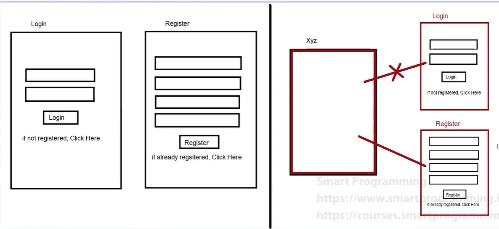

### What is a Fragment?

A Fragment is a modular section of an activity that represents a portion of user interface or behavior in an activity. It's often used to build flexible and reusable UI components. Fragments are lightweight compared to activities, offering better modularity and flexibility in designing complex user interfaces.

### Fragment Working

Fragments work within the context of an activity, allowing developers to divide the UI into smaller, reusable components. These components can be added, removed, or replaced dynamically within an activity's layout, providing a more flexible and interactive user experience.



### Life Cycle of a Fragment

Similar to activities, fragments have their own lifecycle methods that are tied to the lifecycle of the hosting activity. Understanding the fragment lifecycle is crucial for managing UI updates, data loading, and resource allocation efficiently.


### How to Use Fragments

Integrating fragments into an activity involves a few key steps:

#### In the Main Java File:

```java
getSupportFragmentManager()
    .beginTransaction()
    .add(R.id.fragment_container, new MyFragment())
    .commit();
```

Here, `getSupportFragmentManager()` is used to obtain the FragmentManager for interacting with fragments associated with this activity. The `beginTransaction()` method begins a series of edit operations on the Fragments associated with this FragmentManager. `add()` is used to add a fragment to the activity state, and `commit()` is used to apply the changes.

#### In the Fragment File:

```java
getParentFragmentManager()
    .beginTransaction()
    .add(R.id.fragment_container, new MyFragment())
    .commit();
```

Similarly, `getParentFragmentManager()` is used to obtain the FragmentManager associated with the parent activity. The process for adding fragments remains the same as in the main Java file.

