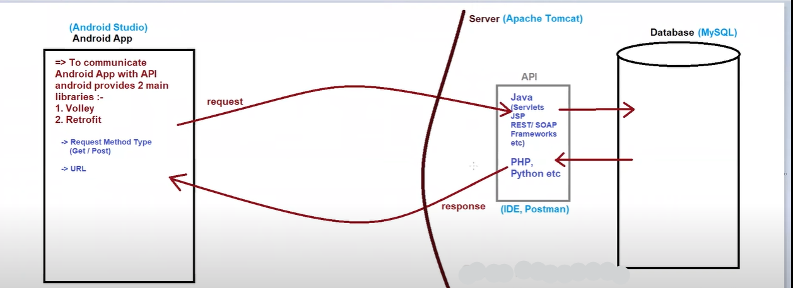

### How Android Communicates with Java API and MySQL

### Softwares Used for Connecting Android with MySQL
1. **Android Studio**: Used to develop the Android app.
2. **Apache Tomcat (Server)**: Used to deploy the API.
3. **MySQL (Database)**: Used to store the data.
4. **IDE (NetBeans, Eclipse, or any other IDE)**: Used to create the API.
5. **Postman**: Used to check if our API is working properly or not, and to check the response of our API.
6. **XAMPP**: XAMPP stands for:
   - X - Cross platform
   - A - Apache
   - M - MySQL
   - P - PHP
   - P - Perl

### If We Develop API in Java (Servlets) Then We Have to Use the Below Softwares:
1. **IDE (NetBeans)**: NetBeans will contain Apache Tomcat Server as well.
2. **Postman**
3. **MySQL**

### If We Develop API in PHP Then We Have to Use the Below Softwares:
1. **IDE**
2. **XAMPP**

working of app and api

=> How to connect mobile to laptop and run the API in mobile :-
1. Connect laptop and mobile to same wifi device OR connect mobile hotspot to laptop
2. Open CMD and run as administrator
3. Type command ‘ipconfig’ and copy the IPv4 Address and paste it in the API URL / link
4. http://localhost:8084/ApiDemo1/Register => http://192.168.1.3:8084/ApiDemo1/Register
5. Run this link in the mobile browser
=> Volley Library :-
= Volley is an HTTP library which is developed by google and was introduced first in 2013
= Its main use is to transmit the data over the network
= It is available through AOSP (Android Open Source Project) repository and thus we have to provide its implementation in
= Advantages of Volley :-
1. Provides efficient network manegement
2. Easier and faster request management
3. Caching
= Classes in Volley Library :-
1. RequestQueue
2. Request
= Types of Requests :-
1. StringRequest
2. JsonObjectRequest
3. JsonArrayRequest
4. ImageRequest I