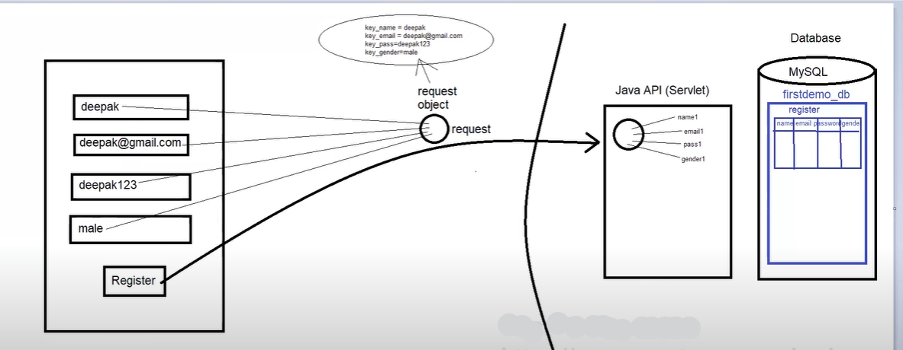

### How Android Communicates with Java API and MySQL

### Softwares Used for Connecting Android with MySQL
1. **Android Studio**: Used to develop the Android app.
2. **Apache Tomcat (Server)**: Used to deploy the API.
3. **MySQL (Database)**: Used to store the data.
4. **IDE (NetBeans, Eclipse, or any other IDE)**: Used to create the API.
5. **Postman**: Used to check if our API is working properly or not, and to check the response of our API.
6. **XAMPP**: XAMPP stands for:
   - X - Cross platform
   - A - Apache
   - M - MySQL
   - P - PHP
   - P - Perl

### If We Develop API in Java (Servlets) Then We Have to Use the Below Softwares:
1. **IDE (NetBeans)**: NetBeans will contain Apache Tomcat Server as well.
2. **Postman**
3. **MySQL**

### If We Develop API in PHP Then We Have to Use the Below Softwares:
1. **IDE**
2. **XAMPP**

### Working of app and api

### How to Connect Mobile to Laptop and Run the API on Mobile

1. Connect the laptop and mobile to the same Wi-Fi device OR connect the mobile hotspot to the laptop.
2. Open CMD and run as administrator.
3. Type the command `ipconfig` and copy the IPv4 Address. Paste it in the API URL/link.
4. Convert `http://localhost:8084/ApiDemo1/Register` to `http://<IPv4 Address>:8084/ApiDemo1/Register`.
   - Example: `http://localhost:8084/ApiDemo1/Register` becomes `http://192.168.1.3:8084/ApiDemo1/Register`.
5. Run this link in the mobile browser.
