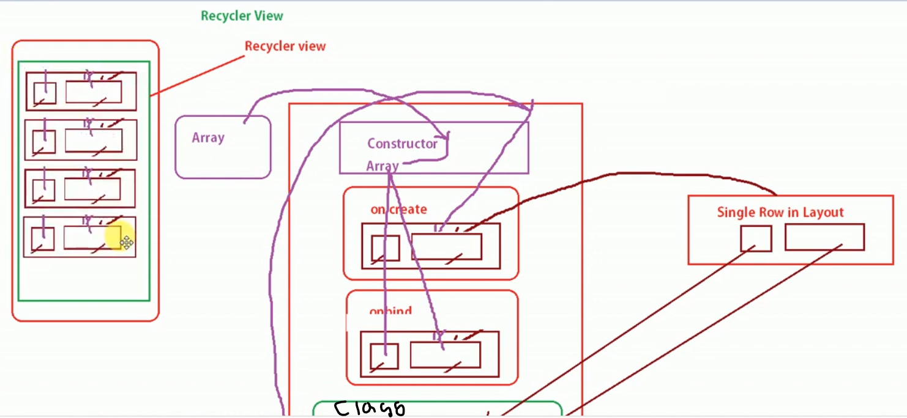

## RecyclerView

RecyclerView is similar to ListView but differs in that it only stores the data currently visible on the screen, which helps to:
- Reduce memory usage

### Note
- Use RecyclerView for better performance and more features when displaying large or complex lists.
- Choose ListView for simple, quick lists in older apps.

### Using RecyclerView
To use RecyclerView, you need to add the necessary dependency to your project.

### Steps to Implement RecyclerView

1. **Design a Single Row Layout**: Create a layout file for a single row/item in the list.

2. **Create an Adapter Class**: The adapter class will include a constructor and two key methods along with a ViewHolder class:
    - **Constructor**: Used to take in data.
    - **onCreateViewHolder()**: Inflate the XML layout for the single row.
    - **onBindViewHolder()**: Bind data to the views.
    - **ViewHolder Class**: Holds the views (single row design). This class will be passed as a generic type to the adapter class, helping to get the object in `onCreateViewHolder()` and `onBindViewHolder()` methods.

### Example Structure of RecyclerView Adapter

```java
public class MyAdapter extends RecyclerView.Adapter<MyAdapter.MyViewHolder> {
    private List<MyDataModel> dataList;

    // Constructor
    public MyAdapter(List<MyDataModel> dataList) {
        this.dataList = dataList;
    }

    // ViewHolder is a static inner class of RecyclerView
    public class MyViewHolder extends RecyclerView.ViewHolder {
        // Define your view elements here

        public MyViewHolder(View itemView) {
            super(itemView);
            // Initialize your view elements here
        }
    }

    @Override
    public MyViewHolder onCreateViewHolder(ViewGroup parent, int viewType) {
        // Inflate the single row layout
        View itemView = LayoutInflater.from(parent.getContext())
                .inflate(R.layout.single_row_layout, parent, false);
        return new MyViewHolder(itemView);
    }

    @Override
    public void onBindViewHolder(MyViewHolder holder, int position) {
        // Bind data to the views
        MyDataModel dataModel = dataList.get(position);
        // Set data to your views
    }

    @Override
    public int getItemCount() {
        return dataList.size();
    }
}
```

### Diagram


### Adding RecyclerView Dependency
To use RecyclerView, you need to add the following dependency in your `build.gradle` file:
```gradle
dependencies {
    implementation 'androidx.recyclerview:recyclerview:1.2.1'
}
```


### Some Additional Notes:

- **Setting Layout Manager**: 
  RecyclerView requires a layout manager to manage the arrangement of its items. In your Java class file, you need to set the layout manager. Commonly used layout managers include LinearLayoutManager, GridLayoutManager, and StaggeredGridLayoutManager.

  Example of setting LinearLayoutManager:
  ```java
  RecyclerView recyclerView = findViewById(R.id.recyclerView);
  recyclerView.setLayoutManager(new LinearLayoutManager(this));
  ```

- **ViewHolder Class**: 
  When creating the ViewHolder class, it assumes that its object has been created, and the view of the designed layout is passed to it from the onCreateViewHolder method. This ViewHolder class uses this passed view object to access the widgets inside the XML layout. Therefore, initialize and declare the widgets inside the ViewHolder class.

  Example ViewHolder class:
  ```java
  public static class MyViewHolder extends RecyclerView.ViewHolder {
      TextView titleTextView;
      ImageView iconImageView;

      public MyViewHolder(View itemView) {
          super(itemView);
          // Initialize your view elements here
          titleTextView = itemView.findViewById(R.id.titleTextView);
          iconImageView = itemView.findViewById(R.id.iconImageView);
      }
  }
  ```

- **onCreateViewHolder and onBindViewHolder**: 
  - **onCreateViewHolder**: Inflates the XML layout for a single row/item in the list and returns a ViewHolder object.
  - **onBindViewHolder**: Binds data to the views within the ViewHolder.

  Example:
  ```java
  @Override
  public MyViewHolder onCreateViewHolder(ViewGroup parent, int viewType) {
      // Inflate the single row layout
      View itemView = LayoutInflater.from(parent.getContext())
              .inflate(R.layout.single_row_layout, parent, false);
      return new MyViewHolder(itemView);
  }

  @Override
  public void onBindViewHolder(MyViewHolder holder, int position) {
      // Bind data to the views
      MyDataModel dataModel = dataList.get(position);
      holder.titleTextView.setText(dataModel.getTitle());
      holder.iconImageView.setImageResource(dataModel.getIconResource());
  }
  ```