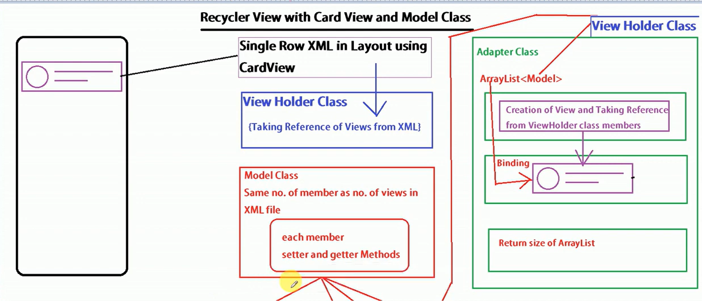

## RecyclerView with CardView

Learn how to professionally implement a RecyclerView with CardView, using separate model and view holder classes.

### Dependencies

- Add RecyclerView and CardView dependencies to your `build.gradle` file.

```gradle
dependencies {
    implementation 'androidx.recyclerview:recyclerview:1.2.1'
    implementation 'androidx.cardview:cardview:1.0.0'
}
```

### Steps to Implement RecyclerView with CardView

1. **Design the Single Row Layout**
   - Create an XML layout file for a single row, incorporating CardView to provide a polished look.

2. **Create the ViewHolder Class**
   - The ViewHolder class references the widgets in the single row design XML file. 
   - Initialize and declare the widgets inside the ViewHolder class.

3. **Create the Model Class**
   - The model class is created based on the number of widgets in the single row design XML file.
   - Include getter and setter methods for these widgets.

4. **Create and Populate an ArrayList**
   - Create an ArrayList and store all the widget objects from the model class in it.

### Visual Representation




### Detailed Steps

1. **Single Row Layout Design**
   - Define an XML layout for a single row, typically including a CardView that contains the various widgets (e.g., TextView, ImageView).

2. **ViewHolder Class**
   - In this class, reference the XML layout widgets by their IDs.
   - This class is responsible for holding and recycling the views as they scroll off the screen.

3. **Model Class**
   - Define a class that represents the data structure for each row in the RecyclerView.
   - Include private member variables for each widget in the row layout.
   - Implement getter and setter methods for these variables.

4. **ArrayList Initialization**
   - Instantiate an ArrayList of the model class.
   - Populate this ArrayList with data objects, representing the content to be displayed in each row of the RecyclerView.

