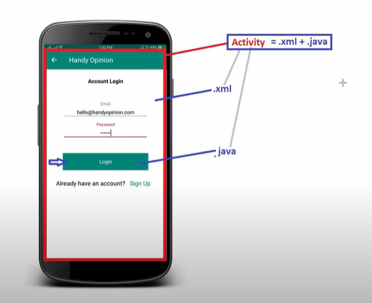

### XML
- **XML** stands for Extensible Markup Language.
- XML is a Markup Language. Other examples of Markup Languages are HTML, DHTML, XHTML, etc.
- XML is also known as a Tag-Based Language.
- **Example:**
  - In HTML we do like this:
  ```html
  <html>
    <head>
      <title> - </title>
    </head>
    <body>
      <input type="text" />
      <Janak>
      </Janak>
    </body>
  </html>
  ```
  - Likewise, in XML:
  ```xml
  <college name="SP Clg" location="Pokhara">
    <branch field="CSE" year="2020">
      <student>
        <name>Janak</name>
        <rollno>101</rollno>
      </student>
      <student>
        <name>Rabin</name>
        <rollno>102</rollno>
      </student>
    </branch>
  </college>
  ```
  Note: Each Tags have its own Attributes
---
### AndroidManifest.xml
- **It contains the details of our Android application:**
  1. How many activities we have created and their names
  2. Which activity should open first
  3. Permissions
  4. App theme, icons
  5. Services
  etc.

**What is an activity?**
- **Activity** simply refers to the XML and Java file combination, meaning the design and the backend part are known as activity.

- `Here is the image to Understand Activity`


---


### Understanding `Res` folder
- **Drawable**
  - Includes icon images, gradients, shapes, etc.
- **Layout**
  - Includes all layouts of our apps which include widgets
- **Mipmap**
  - Includes launcher icons
- **Values**
  - We can provide all the colors needed for the application
  - We can also provide all the strings here
- **Themes**
  - Themes for our APK

---

### Gradle
- **Gradle** is an open source build system used to automate building, testing, deployment, etc., of our application.
- Gradle is also used to generate the .apk file from .java and .xml files.
- Gradle (build.gradle) contains information about min SDK version, target SDK, Android app versions, etc.

---

### Android SDK
- **SDK** stands for "Software Development Kit."
- As the name suggests, Android SDK is a set of development tools which includes debugger, libraries, documentation, sample codes, tutorials, emulator (AVD), etc.
- Whenever Google releases a new Android version, it also releases a new version of the SDK.

- **Android SDK contains three components:**
  1. SDK Platforms
  2. SDK Tools
  3. SDK Update Sites

---
### Emulator (AVD)
- **Emulator** is a virtual device that acts the same as a physical mobile device.
- Emulator is used to test, debug, and execute our Android application.
- Emulator is a heavy device, so our system configuration should be high to use the emulator.
---