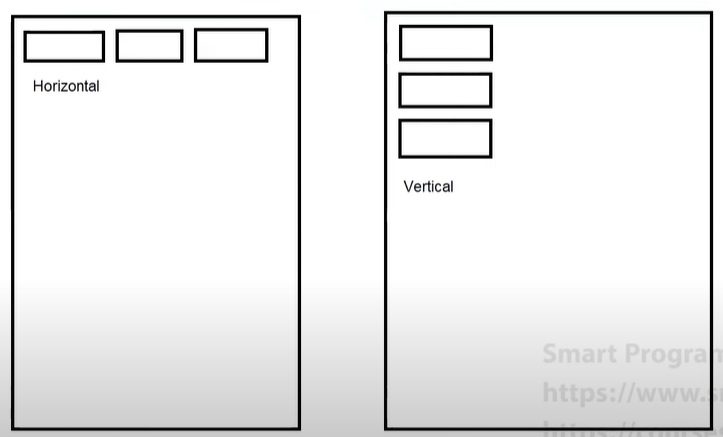

### View
- View refers to the `android.view.View` class which is the parent class of all the UI classes.
- Examples of Views are TextView, Button, CheckBox, ImageView, etc.
- View is a simple rectangular box which can respond to user actions.

### ViewGroup
- ViewGroup refers to the `android.view.ViewGroup` which is the parent class for layouts and layout parameters.
- Examples are LinearLayout, RelativeLayout, ConstraintLayout, FrameLayout, etc.
- ViewGroup is the invisible container which holds the Views or ViewGroups.

### Android Layouts
- Layout refers to the arrangement of elements i.e. TextView, Buttons, etc. on the container.
- Examples are LinearLayout, RelativeLayout, etc.
---
### Starting Concept of All Layout:

### 1. LinearLayout:
- It arranges widgets into **horizontally** and **vertically**.
- By default, its orientation is horizontal.
- It can contain other layouts.

Some important attributes are:
- `gravity`
- `orientation`
- `layout_weight` for widgets (child)
- `padding`, `margin`
- `divider`, `showDivider`

Practice this for understandig Linear layout:

---
### 2. RelativeLayout:
- It arranges the widgets relative to the other layout and widgets.
- By default, it overlaps the widgets at the top-left corner.

Some important attributes for widgets are:
- `layout_centerInParent`
- `layout_toStartOf`
- `layout_toEndOf`
- `layout_centerVertical`
- `layout_centerHorizontal`
- `layout_alignParentBottom`

Practice this for understanding RelativeLayout:

---
### ConstraintLayout:
- It is the latest layout introduced in 2016 and supports Android 2.3 or higher versions.
- It is a ViewGroup which allows us to create large and complex layouts with a flat view hierarchy.
- Its main advantage is that it reduces the nesting of View or ViewGroup which in turn improves the performance.
- It is very similar to RelativeLayout because it also defines relationships between multiple Views.

**Note:** It is compulsory to provide at least one vertical and one horizontal constraint.

### Terms in ConstraintLayout:
1. Constraint attributes
2. How to add and remove constraint
3. Bias (Horizontal and Vertical)
4. Chain (Horizontal and Vertical)

### Important Attributes:
- `layout_constraintStart_toStartOf`
- `layout_constraintEnd_toEndOf`
- `layout_constraintTop_toTopOf`
- `layout_constraintBottom_toBottomOf`
- `layout_constraintHorizontal_bias`
- `layout_constraintVertical_bias`
- `layout_constraintHorizontal_chainStyle`
- `layout_constraintVertical_chainStyle`
---